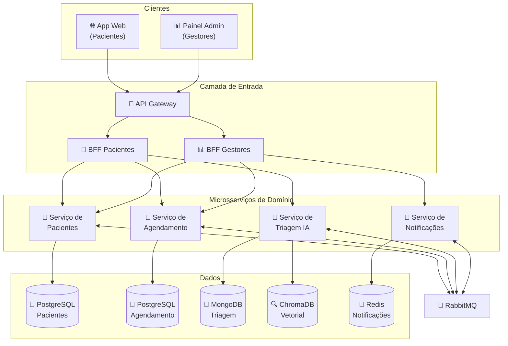
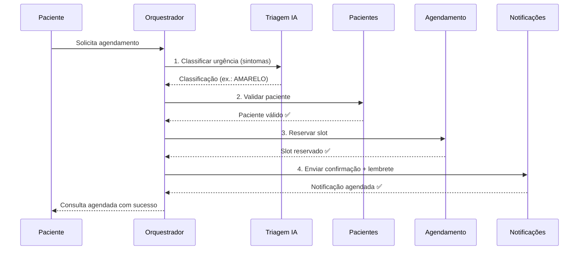

# 🏥 SaúdeConecta

> *Conectando comunidades à saúde que precisam*

`GCC129 — Sistemas Distribuídos` · `UFLA · 2026/2` · `Parte 1 — Concluída ✅`

**Repositório:** [github.com/multiheros/saude-conecta](https://github.com/multiheros/saude-conecta)

---

## 🧭 Navegação rápida

| # | Seção |
|---|-------|
| 1 | [Resumo em 30 segundos](#-resumo-em-30-segundos) |
| 2 | [Equipe](#-equipe) |
| 3 | [O Problema](#-o-problema) |
| 4 | [Os Números](#-os-números) |
| 5 | [Fundamentação](#-fundamentação) |
| 6 | [Impacto Social](#-impacto-social) |
| 7 | [A Solução](#-a-solução) |
| 8 | [Arquitetura](#️-arquitetura) |
| 9 | [Como Executar](#-como-executar) |
| 10 | [Status das Etapas](#-status-das-etapas) |
| 11 | [Governança Git](#-governança-git) |
| 12 | [Documentação](#-documentação) |
| 13 | [Referências](#-referências) |

---

## ⚡ Resumo em 30 segundos

- **O que é:** plataforma de agendamento digital e triagem assistida por IA para Unidades Básicas de Saúde (UBS) do SUS.
- **Para quem:** pacientes da Atenção Primária e gestores municipais de saúde.
- **Diferencial:** triagem de urgência com **LLM + RAG** sobre protocolos médicos oficiais, em uma arquitetura de **4 microsserviços** com **SAGA** e **CQRS**.

---

## 👥 Equipe

| Nome | GitHub |
|------|--------|
| Jonathan Nascimento Carvalho | [@multiheros](https://github.com/multiheros) |
| Maria Lina da Silva | [@Marialinaa](https://github.com/Marialinaa) |
| Matheus Gomes | [@MatheusssGM](https://github.com/MatheusssGM) |

---

## 🎯 O Problema

> **Por que, em pleno século 21, milhões de brasileiros ainda enfrentam filas de madrugada apenas para marcar uma consulta no posto de saúde?**

- **93,8% das UBS** ainda realizam agendamento **presencial** — o paciente se desloca até a unidade apenas para tentar pegar um horário *(Censo UBS 2024 — RESBR/MS)*.
- **57 dias** é o tempo médio de espera por consulta especializada, ultrapassando **150 dias** em algumas regiões *(APM/CFM, 2024)*.
- **20% a 30%** dos pacientes **faltam** às consultas agendadas — cada falta é um horário desperdiçado que poderia atender outra pessoa.
- **Desigualdade no acesso:** quem depende exclusivamente do SUS enfrenta as maiores barreiras, que variam por renda, escolaridade e região *(IBGE — PNS 2019)*.

<details>
<summary>📖 Contexto completo</summary>

O Sistema Único de Saúde (SUS) é o maior sistema de saúde pública do mundo, atendendo **mais de 150 milhões de brasileiros** que dependem exclusivamente da rede pública. Apesar dos avanços reconhecidos internacionalmente, a **Atenção Primária à Saúde (APS)** — porta de entrada do SUS — enfrenta problemas crônicos que comprometem o acesso efetivo da população:

- **Filas e tempo de espera excessivos:** o tempo médio de espera para consulta especializada no SUS é de aproximadamente **57 dias**, com disparidades regionais que ultrapassam **150 dias** em algumas áreas (APM, 2024).
- **Absenteísmo elevado:** entre **20% e 30%** dos pacientes faltam às consultas agendadas em UBS, desperdiçando recursos escassos e aumentando filas para outros pacientes.
- **Agendamento predominantemente presencial:** o Censo das UBS 2024 revelou que **93,8% das unidades** ainda realizam agendamentos de forma presencial, exigindo que o paciente se desloque até a unidade apenas para marcar uma consulta.
- **Triagem ineficiente:** a classificação de risco é frequentemente feita de forma subjetiva ou não é realizada, levando pacientes urgentes a esperarem junto com casos eletivos.
- **Desigualdade regional:** a cobertura da Estratégia Saúde da Família apresenta enormes disparidades regionais, com comunidades periféricas e rurais enfrentando as maiores barreiras de acesso.

</details>

---

## 📊 Os Números

| Indicador | Valor | Fonte |
|-----------|-------|-------|
| Agendamento ainda 100% presencial nas UBS | **93,8%** | Censo UBS 2024 (RESBR/MS) |
| Tempo médio de espera por especialista | **57 dias** | APM/CFM, 2024 |
| Espera em regiões mais críticas | **150+ dias** | APM/CFM, 2024 |
| Taxa de faltas em consultas agendadas | **20–30%** | Ciência & Saúde Coletiva |
| Cobertura da Estratégia Saúde da Família | **76%** (com forte desigualdade regional) | IBGE, 2023 |

> **Cada falta é uma consulta desperdiçada para outra pessoa.**

---

## 📚 Fundamentação

> Nossa proposta não é baseada em achismos.

| # | Referência | O que sustenta |
|---|-----------|----------------|
| 1 | **Paim et al. (2011)** — *The Lancet* | Desigualdades regionais persistem na atenção primária |
| 2 | **IBGE — PNS 2019** | Acesso varia conforme renda, escolaridade e região |
| 3 | **Censo UBS 2024 (RESBR/MS)** | 93,8% das UBS agendam presencialmente |
| 4 | **Giovanella et al. (2009)** — *Ciência & Saúde Coletiva* | Limites da Saúde da Família como atenção integral |

<details>
<summary>📖 Referências complementares</summary>

- **APM/CFM (2024)** — dados sobre tempo de espera para consultas especializadas no SUS.
- **OMS/OPAS (2023)** — relatórios sobre cobertura de saúde nas Américas.
- **CGI.br (2024)** — TIC Saúde 2024.

Lista completa e formatada em [Referências](#-referências).

</details>

---

## 🌍 Impacto Social

### Quem é beneficiado

| Grupo | Como é beneficiado |
|-------|-------------------|
| **Famílias de baixa renda** | Agendamento sem filas presenciais; deixam de perder diárias de trabalho só para tentar marcar consulta |
| **Idosos e mães com filhos pequenos** | Não precisam mais se deslocar até a UBS apenas para agendar |
| **Profissionais de saúde** | Agenda mais organizada, triagem prévia e menos "furos" por absenteísmo |
| **Gestores municipais** | Dados em tempo real para alocação de recursos e identificação de gargalos |
| **O SUS como sistema** | Redução do desperdício e melhor cobertura efetiva |

### Como medir

| Métrica | Linha de base | Meta |
|---------|--------------|------|
| Tempo para agendar consulta | Meia jornada (presencial) | **< 5 minutos** (digital) |
| Taxa de absenteísmo | 20–30% | **redução de 30–50%** |
| Adequação da triagem | Subjetiva / não realizada | **> 85%** de concordância com o médico |
| Cobertura de agendamento digital | ~6% | **crescimento progressivo** pela plataforma |
| Satisfação do usuário | — | **NPS** dos pacientes |

<details>
<summary>📖 Teoria da mudança</summary>

```
Agendamento digital + Triagem com IA + Lembretes automáticos + Dashboard para gestores
        ↓                    ↓                     ↓                      ↓
Eliminação de filas   Priorização        Redução do            Dados para
 para marcar          objetiva por       absenteísmo           decisão
                      urgência
        ↓                    ↓                     ↓                      ↓
                    MELHOR ACESSO À SAÚDE PRIMÁRIA
                              ↓
              REDUÇÃO DAS DESIGUALDADES NO ACESSO AO SUS
```

</details>

---

## 💡 A Solução

O **SaúdeConecta** é uma plataforma de **agendamento inteligente e triagem assistida por IA** para UBS, com dois clientes distintos.

### 📱 Para o Paciente

- Agendamento digital com visualização de disponibilidade em tempo real.
- **Triagem inteligente:** descreve os sintomas e o sistema classifica a urgência com base em protocolos médicos (IA + RAG).
- Lembretes automáticos e orientação pré-consulta.
- Histórico simplificado de atendimentos.

### 📊 Para o Gestor de Saúde

- Dashboard de **ocupação em tempo real** (agendado vs. capacidade).
- Métricas de demanda por região, especialidade e período.
- Gestão de escalas e relatórios de absenteísmo.
- **Alertas de gargalo** quando a demanda supera a capacidade.

### 🛠️ Stack Tecnológica

| Camada | Tecnologia |
|--------|-----------|
| Serviços de domínio | Python (FastAPI) + Node.js (NestJS/Express) |
| Bancos de dados | PostgreSQL · MongoDB · Redis · ChromaDB |
| Mensageria | RabbitMQ |
| IA | LLM + RAG (LangChain + ChromaDB) |
| API Gateway / BFFs | Kong/NGINX + 2 BFFs (web e admin) |
| Frontends | React (app do paciente + painel do gestor) |
| Infra | Docker + Docker Compose + Kubernetes |

---

## 🏗️ Arquitetura

Arquitetura de **microsserviços** com **Database per Service**, comunicação síncrona (REST) e assíncrona (RabbitMQ).



### Os 4 microsserviços

| Serviço | Responsabilidade | Banco |
|---------|------------------|-------|
| **Pacientes** | Cadastro, autenticação, perfil, histórico | PostgreSQL |
| **Agendamento** | Slots, reservas, disponibilidade, escalas | PostgreSQL |
| **Triagem IA** | Classificação de urgência (LLM + RAG), orientação | MongoDB + ChromaDB |
| **Notificações** | Lembretes, confirmações, alertas | Redis |

### Padrões distribuídos (Parte 2)

- **API Gateway** — ponto único de entrada, autenticação, rate limiting e roteamento para os serviços internos.
- **2 BFFs** — `bff-web` (paciente) devolve dados simples, pessoais e acionáveis; `bff-admin` (gestor) devolve dados agregados e analíticos.
- **Database per Service** — cada serviço com seu próprio banco; integração só por API/evento.
- **SAGA orquestrada** — no fluxo de agendamento: `triagem → pacientes → agendamento → notificações`, com transações compensatórias.
- **CQRS** — no serviço de Agendamento: escrita normalizada separada da leitura desnormalizada (defasagem aceitável ≤ 5s).
- **Outbox** — publicação confiável de eventos via RabbitMQ.

<details>
<summary>📖 SAGA — caminho feliz e cenário de falha</summary>

**Caminho feliz**



**Compensações (todos os passos têm reversão)**

| Passo | Ação | Compensação |
|-------|------|-------------|
| 1. Triagem | Classificar urgência | Descartar classificação temporária |
| 2. Pacientes | Validar e marcar "agendamento em andamento" | Reverter flag |
| 3. Agendamento | Reservar slot | Liberar slot reservado |
| 4. Notificações | Agendar confirmação | Cancelar notificação agendada |

</details>

---

## 🚀 Como Executar

> ⚠️ **Em desenvolvimento.** As instruções completas (Docker Compose e Kubernetes) serão adicionadas na **Parte 3**.

Requisitos previstos: **Docker** e **Docker Compose** (ambiente local).

---

## 🗺️ Status das Etapas

| Etapa | Status | Data |
|-------|--------|------|
| **Parte 1** — Concepção e Pitch | 🟢 Concluída | 17/09/2026 |
| **Parte 2** — Arquitetura | ⬜ Pendente | 22–27/10/2026 |
| **Parte 3** — Containerização e K8s | ⬜ Pendente | 17/11/2026 |
| **Parte 4** — Sistema Funcional | ⬜ Pendente | 10–15/12/2026 |

---

## 🔀 Governança Git

- Desenvolvimento em **branches por funcionalidade** (`feat/`, `fix/`, `docs/`, `infra/`, `test/`, `refactor/`).
- Integração **somente via Pull Request** com **1 review aprovado** de outro integrante.
- **`main` protegida:** sem push direto e sem auto-aprovação.
- Trabalho em par registrado com `Co-authored-by:`.
- Commits distribuídos ao longo do semestre.

---

## 📂 Documentação

| Documento | Descrição |
|-----------|-----------|
| [`docs/parte1_concepcao.md`](docs/parte1_concepcao.md) | Concepção, problema, impacto social e referências (Parte 1) |
| `docs/arquitetura/` | Diagramas de componentes, comunicação e SAGA *(Parte 2)* |
| `docs/api/` | Contratos OpenAPI dos serviços *(Parte 2)* |
| `docs/decisoes-tecnicas.md` | Decisões de arquitetura (ADRs) *(Parte 2)* |
| `docs/rag-avaliacao.md` | Avaliação do pipeline RAG *(Parte 4)* |

---

## 📚 Referências

### Base acadêmica e institucional

1. **PAIM, J. et al.** (2011). "The Brazilian health system: history, advances, and challenges." *The Lancet*, 377(9779), 1778-1797. DOI: [10.1016/S0140-6736(11)60054-8](https://doi.org/10.1016/S0140-6736(11)60054-8)
2. **IBGE** (2020). *Pesquisa Nacional de Saúde 2019: Informações sobre domicílios, acesso e utilização dos serviços de saúde.* Rio de Janeiro: IBGE. Disponível em: [ibge.gov.br](https://www.ibge.gov.br/estatisticas/sociais/saude/9160-pesquisa-nacional-de-saude.html)
3. **Ministério da Saúde / RESBR** (2024). *Censo das Unidades Básicas de Saúde 2024.* Rede de Pesquisa em APS. Disponível em: [resbr.net.br](https://resbr.net.br)
4. **GIOVANELLA, L. et al.** (2009). "Saúde da família: limites e possibilidades para uma abordagem integral de atenção primária à saúde no Brasil." *Ciência & Saúde Coletiva*, 14(3), 783-794. DOI: [10.1590/S1413-81232009000300014](https://doi.org/10.1590/S1413-81232009000300014)

### Complementares

5. **CFM / APM** (2024). Dados sobre tempo de espera para consultas especializadas no SUS. *Conselho Federal de Medicina / Associação Paulista de Medicina.*
6. **OMS/OPAS** (2023). Relatórios sobre cobertura de saúde nas Américas.

---

*GCC129 — Sistemas Distribuídos — UFLA — 2026/2*
